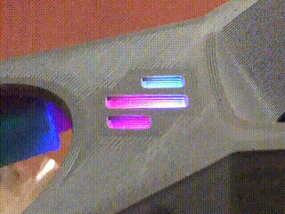

# Klipper Shake&Tune plugin

Shake&Tune is a Klipper plugin from the [Klippain](https://github.com/Frix-x/klippain) ecosystem, designed to create insightful visualizations to help you troubleshoot your mechanical problems and give you tools to better calibrate the input shaper filters on your 3D printer. It can be installed on any Klipper machine and is not limited to those using the full Klippain.

Check out the **[detailed documentation here](./docs/README.md)**.

# Rainbow Barf Logo LED for StealthBurner

### *a [vinnycordeiro](https://github.com/VinnyCordeiro/) and whoppingpochard jam*

-----------

Ok, sure, it's pretty cool to have the Voron logo on the StealthBurner light up. And, yeah, it's even cooler to have it change colors. But wouldn't it be *even cooler still* to have it do *this*?

The Rainbow Barf Logo LED is a small PCB, approximately the size of a typical single 5050 WS2812 "Neopixel" PCB, but holding *eight* miniature protocol-compatible LEDs positioned to match the logo cutout on the StealthBurner.

This gives you the possibility to programmatically address each part of the logo lighting independently! Imagine the possibilities!

# LED Effects for Klipper

## Description

This is the standalone repository of the Klipper LED Effects module developed by [Paul McGowan](https://github.com/mental405) with contributions from myself.
It allows Klipper to run effects and animations on addressable LEDs, such as Neopixels, WS2812 or SK6812.

Check out Paul's printer:

See the chapter in this video from Vector3D what it can do and how to set it up (start from the beginning to learn how to connect the LEDs):

And this one (in french) from Tom's Basement:

